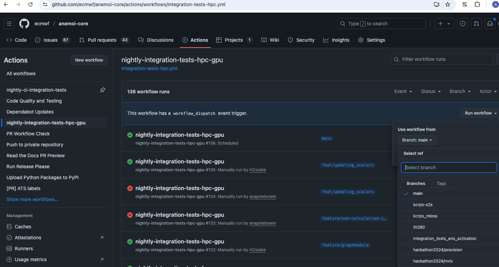

.. _testing-guidelines:

#########
 Testing
#########

Comprehensive testing is crucial for maintaining the reliability and
stability of the Anemoi packages. This guide outlines our testing
strategy and best practices for contributing tests.

We use pytest as our primary testing framework. Pytest offers a simple
and powerful way to write and run tests for Python projects. For more
details, refer to the `pytest documentation
<https://docs.pytest.org/en/stable/>`_.

****************
 Types of Tests
****************

Unit Tests
==========

-  Test individual components in isolation.
-  Should constitute the majority of test cases.
-  Unit tests reside in `tests/` or, for packages with integration
   tests, in `tests/unit`

Integration Tests
=================

-  Test how different components work together.
-  Important for data processing pipelines and model training workflows.
-  Integration tests reside in `tests/integration`.

System-level Tests
==================

-  Test the anemoi packages as a whole, including end-to-end workflows,
   from dataset creation to model training and inference.
-  These tests ensure that the packages work together as expected.
-  The system-level test suite is located in the `anemoi-docs`
   repository in the `tests/system-level` directory.

***************
 Running Tests
***************

Ensure that you have the testing dependencies installed. You can do this
by running:

.. code:: bash

   pip install -e .[test]

We use the ``pytest-skip-slow`` plugin to skip slow tests by default.

To run all **unit tests**:

.. code:: bash

   pytest

To run tests in a specific file:

.. code:: bash

   pytest tests/unit/test_specific_feature.py

To run all **integration tests**, including slow-running tests, use the
`--slow` flag. Follow the package-specific instructions. For integration
tests in anemoi-training, for instance, ensure that you have GPU
available and run:

.. code:: bash

   pytest training/tests/integration/ --slow

Integration tests can also be triggered from the Github Actions
interface. To do so, one needs to navigate to the Github Actions tab
under the corresponding anemoi package and then select from the list on
the left the workflow (for example
``nightly-integration-tests-hpc-gpu``). Next, one needs to select the
branch from which to trigger this workflow from the dropbox list on the
right and finally a green button showing ``Run workflow`` will appear
and once clicked would trigger this worfklow. Please refer to `Github
docs for more information.
<https://docs.github.com/en/actions/how-tos/manage-workflow-runs/manually-run-a-workflow>`_

.. note::

   To trigger these workflows, users must be members of the 'ecmwf'
   GitHub organization and have 'write' permissions

.. raw:: html

     

To run **system-level tests**, navigate to the `anemoi-docs` repository
on github and trigger the workflow `on-demand-system-level-test` via the
GitHub Actions tab.

.. note::

   Do not trigger system-level tests if another system-level test
   workflow is already running under your user account. This is to avoid
   ecflow zombies when replacing a suite that is already running.

   If you need to replace a running suite, please wait for it to finish
   or cancel it first.

***************
 Writing Tests
***************

General Guidelines
==================

#. Write tests for all new features and bug fixes.
#. Aim for high test coverage, especially for critical components.
#. Keep tests simple, focused, and independent of each other.
#. Use descriptive names for test functions, following the pattern
   `test_<functionality>_<scenario>`.
#. Follow the :ref:`naming-conventions` for test files.
#. Keep tests fast: Optimize slow tests or mark them for separate
   execution.
#. Use appropriate assertions: pytest provides a rich set of assertions.
#. Test edge cases and error conditions, not just the happy path.
#. Regularly review and update tests as the codebase evolves.
#. Document complex test setups or scenarios.

By following these guidelines and continuously improving our test suite,
we can ensure the reliability and maintainability of Anemoi Training.

Example Test Structure
======================

.. code:: python

   import pytest
   from anemoi.training import SomeFeature

   def test_some_feature_normal_input():
       feature = SomeFeature()
       result = feature.process(normal_input)
       assert result == expected_output

   def test_some_feature_edge_case():
       feature = SomeFeature()
       with pytest.raises(ValueError):
           feature.process(invalid_input)

Tests features
==============

Here are some pytest features commonly used in the Anemoi packages.

Pytest's `parametrize
<https://docs.pytest.org/en/stable/how-to/parametrize.html>`_ decorator
can be used to run the same test with different inputs.

.. code:: python

   @pytest.mark.parametrize(
       "input,expected",
       [
           (2, 4),
           (3, 9),
           (4, 16),
       ],
   )
   def test_square(input, expected):
       assert square(input) == expected

Pytest's `fixtures
<https://docs.pytest.org/en/stable/how-to/fixtures.html>`_ can be used
to set up common test data or objects.

.. code:: python

   @pytest.fixture
   def sample_dataset():
       # Create and return a sample dataset
       pass

   def test_data_loading(sample_dataset):
       # Use the sample_dataset fixture in your test
       pass

Mocking external dependencies or complex objects can be achieved using
`unittest.mock <https://docs.python.org/3/library/unittest.mock.html>`_
or `pytest-mock <https://pytest-mock.readthedocs.io/en/latest/>`_.

.. code:: python

   def test_api_call(mocker):
       mock_response = mocker.Mock()
       mock_response.json.return_value = {"data": "mocked"}
       mocker.patch("requests.get", return_value=mock_response)

       result = my_api_function()
       assert result == "mocked"

Test Coverage
=============

We use pytest-cov to measure test coverage. To check coverage:

.. code:: bash

   pytest --cov=anemoi_training

Aim for at least 80% coverage for new features, and strive to maintain
or improve overall project coverage.

***************************
 Writing Integration Tests
***************************

Marking Long-Running Tests
==========================

For slow-running integration tests, we use the `--slow` flag to ensure
that they are run only when necessary. This means that you should add
the correspondong marker to these tests:

.. code:: python

   @pytest.mark.slow
   def test_long():
         pass

Configuration Handling
======================

Integration tests in anemoi-training, anemoi-datasets, etc., rely on
appropriate handling of configuration files. Configuration management is
essential to ensure that the tests remain reliable and maintainable. Our
approach includes:

#. Using Configuration Templates: Always start with a configuration
   template from the repository to minimize redundancy and ensure
   consistency. We expect the templates to be consistent with the code
   base and have integration tests that check for this consistency.

#. Test-specific Modifications: Apply only the necessary
   use-case-specific (e.g. related to the dataset) and testing-specific
   (e.g. batch_size or restricted date range) modifications to the
   template.

#. Reducing Compute Load: Where possible, reduce the number of batches,
   epochs, batch sizes, number of dates etc.

#. Debugging and Failures: When integration tests fail, check the config
   files (e.g. in `training/src/anemoi/training/config`) for
   inconsistencies with the code and update the config files if
   necessary. Also check if test-time modifications have introduced
   unintended changes.

For more details and package-specific examples, please refer to the
package-level documentation.

***************************************************
 Adding a Test Case in the System-level Test Suite
***************************************************

To add a test case in the system-level test suite, you need to add
config files in the relevant directory in the `anemoi-docs` repository.
The config files should be placed in the `tests/system-level/configs`
directory as explained below. They will constitute tasks in the
system-level test suite. No pyflow knowledge is required to add new test
cases.

Dataset Creation Test cases
===========================

To add a new test case for dataset creation create a new folder in the
`tests/system-level/anemoi_test/configs/datasets` directory. The name of
the folder will be the name of the test case and of the dataset created.
In the folder add

#. a `dataset_config.yaml` file with the configuration for the dataset
   creation. Currently, the only source supported in the test suite is
   `mars`.

#. a `task_config.yaml` file that specifies additional information
   required to configure the task in the suite. The task config should
   specify the `dataset_command` to be used to create the dataset --
   typically, "anemoi-datasets create". Hardware overrides (e.g. path to
   the `dataset_config.yaml` file) will be set in the suite.

If you need additional flexibility in configuring your test case, please
open an issue in the `anemoi-docs` repository.

Model Training Test cases
=========================

To add a new test case for model training, create a new folder in the
`tests/system-level/anemoi_test/configs/training` directory. The name of
the folder will be the name of the test case. In the folder add

#. a `training_config.yaml` file with the configuration for the model
   training. The configuration should be a full config file, i.e. not
   require hydra to build a config based on defaults. The dataset names
   should match the names of datasets created in the previous part of
   the suite. (If you want to test training based on an existing
   anemoi-dataset, consider adding an integration test in the
   `anemoi-training` package instead.)

#. a `task_config.yaml` that specifies additional information required
   to configure the task in the suite. The `task_config.yaml` should
   contain a list of dataset names that are required for the training
   task. The names should match the names of the datasets specified in
   the `training_config.yaml`. The `task_config.yaml` should also
   specify the `training_command` to be used to run the training --
   typically, "anemoi-training train". Hardware overrides (e.g. path to
   the `training_config.yaml` file) will be set in the suite.
